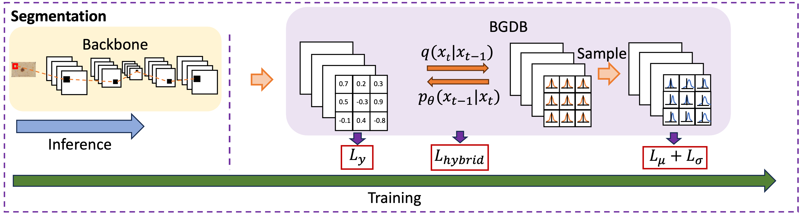

<div align="center">

# BGDB: Bernoulli-Gaussian Decision Block with Improved Denoising Diffusion Probabilistic Models

**Authors**: Chengkun Sun, Jinqian Pan, Russell Stevens Terry, Jiang Bian, Jie Xu

[](https://arxiv.org/abs/2409.13116)
[](https://ojs.aaai.org/index.php/AAAI/article/view/34279)

</div>
<p align="center">
  
</p>

## Installation
```bash
git clone https://github.com/sunck1/BGDB.git
cd BGDB
git submodule update --init --recursive

conda env create -f environment.yml
conda activate BGDB
```

## Training Example

Run the following command to train BGDB-DeepLabV3+ on Cityscapes:

```bash
python main.py \
  --model deeplabv3plus_mobilenet \
  --crop_val \
  --lr 0.01 \
  --crop_size 256 \
  --batch_size 16 \
  --output_stride 16 \
  --data_root "" \
  --dataset voc \
  --random_seed 777 \
  --total_itrs 5000
```
To achieve better performance, we tune the loss weights by appropriately reducing the coefficients of
$L_{\mathrm{hybrid}}$ and $L_{\mu} + L_{\sigma}$, which are adjusted within the range of $[0,1]$.

## Root Directory Overview

The root-level files extend DeepLabV3+ with BGDB and custom diffusion models.

| File | Description |
|------|-------------|
| **main.py** | Training entry point. Largely based on `DeepLabV3/main.py`, but augmented to integrate BGDB: it patches diffusion modules, overwrites the segmentation base class, loads configs, and **adds the BGDB loss terms** (mean/variance diffusion loss + decision block loss) on top of the original DeepLabV3 training loop. |
| **utils.py** | Defines `MySimpleSegmentationModel`, which **overwrites** the original `_SimpleSegmentationModel` in `DeepLabV3/network/utils.py`. This custom segmentation base class integrates BGDB diffusion logic, microbatch training, and YAML-based configuration loading. It also provides the patched `approx_standard_normal_cdf_patched`, which is used to override `approx_standard_normal_cdf` inside `improved-diffusion/improved_diffusion/losses.py`. |
| **script_util.py** | Provides a patched diffusion API that **overrides parts of** `improved_diffusion/improved_diffusion/script_util.py`, redirecting all model/diffusion creation calls to the root-level implementations (patched Gaussian Diffusion, patched CDF, and custom UNet wrapper). |
| **gaussian_diffusion.py** | Patched diffusion module that part overwrites `improved_diffusion.gaussian_diffusion`. Both `p_sample()` and `p_sample_loop()` return **extended dictionaries**, including `sample`, `pred_xstart`, `mean`, and a masked `variance` (derived from the model’s predicted standard deviation). These additional fields are required by the BGDB loss terms during training. |
| **dist_util.py** | A lightweight, MPI-free distributed utility that **overrides** `improved_diffusion/improved_diffusion/dist_util.py`, removing OpenAI’s MPI dependency while preserving the required distributed API calls used by the diffusion model. |

## Acknowledgements
This project is based on:
- https://github.com/VainF/DeepLabV3Plus-Pytorch
- https://github.com/openai/improved-diffusion

Special thanks to the authors for making research and development easier.

## Citation
If this project contributes to your work, please cite the following paper:

```
@inproceedings{sun2025bgdb,
  title={BGDB: Bernoulli-Gaussian Decision Block with Improved Denoising Diffusion Probabilistic Models},
  author={Sun, Chengkun and Pan, Jinqian and Terry, Russell Stevens and Bian, Jiang and Xu, Jie},
  booktitle={Proceedings of the AAAI Conference on Artificial Intelligence},
  volume={39},
  number={19},
  pages={20681--20689},
  year={2025}
}
```
